# 🎬 Cinema Management System (Frontend)

A comprehensive professional dashboard designed to automate cinema operations, including repertoire management, session scheduling, ticket booking, and payment processing in a distributed microservice environment.

## 🚀 Key Features

### 🎞️ Movie & Session Management

- **Movie Catalog:** Searchable database of movies with detailed cards showing descriptions, genres, duration, and ratings.
- **Session Scheduling:** Create and manage movie sessions with specific timing and pricing logic.
- **Full CRUD:** Dedicated interfaces for creating, editing, and deleting movies and sessions.

### 🎟️ Booking System

- **Reservation Flow:** Book seats directly from a movie's detail page or through the specialized Bookings section.
- **Manual Seat Selection:** Flexible text-based seat assignment (e.g., "Row 1, Seat 2").
- **Booking Control:** A centralized table to track customer names, seat counts, and total costs.
- **Filtering:** Advanced filtering by booking status (Pending, Confirmed, Cancelled).

### 💳 Payment & Refund Integration

- **Automated Billing:** Create payments for "Confirmed" bookings with automatic price synchronization.
- **Payment Methods:** Support for multiple payment methods.
- **Refund Logic:** Built-in "Refund" functionality, available for sessions that have not yet concluded.

## 🛠️ Tech Stack

- **Framework:** React with TypeScript (Vite)
- **Styling:** Tailwind CSS (Responsive and consistent UI)
- **Data Fetching:** Axios (Integration with microservice API)
- **Form Management:** `react-hook-form` (Efficient validation and state handling)
- **Routing:** `react-router-dom` (Modular navigation between movies, bookings, and payments)
- **Icons:** `react-icons`

## 📸 System Preview

| Movie Catalog                       | Search Movie                                  | Create Movie                                  |
| :---------------------------------- | :-------------------------------------------- | :-------------------------------------------- |
| 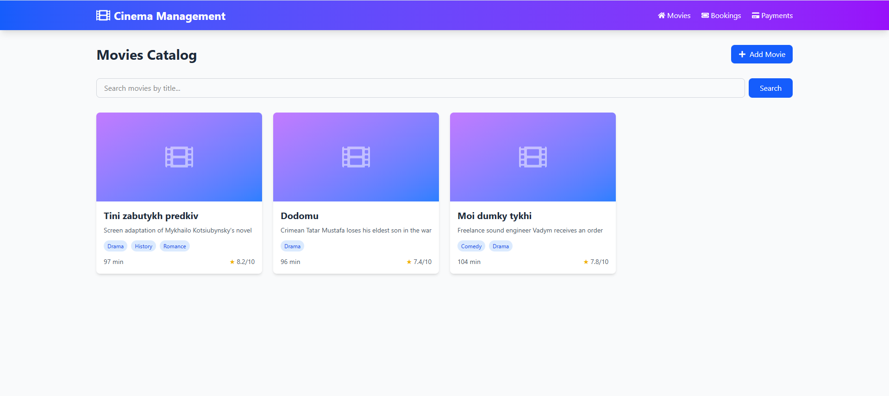 | 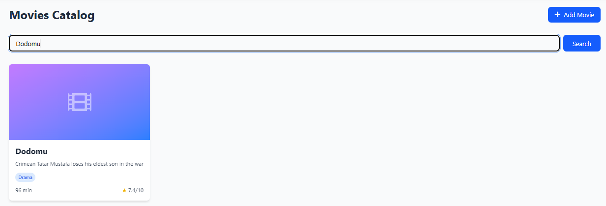 | 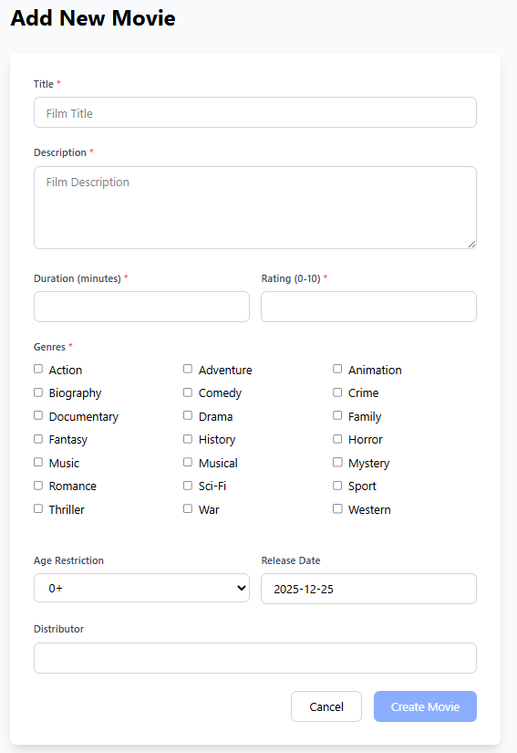 |

| Movie Detail Page                                       | Edit Movie                                | Create Session                                    | Create Booking from Session                                            | Edit Session                                  |
| :------------------------------------------------------ | :---------------------------------------- | :------------------------------------------------ | :--------------------------------------------------------------------- | :-------------------------------------------- |
| 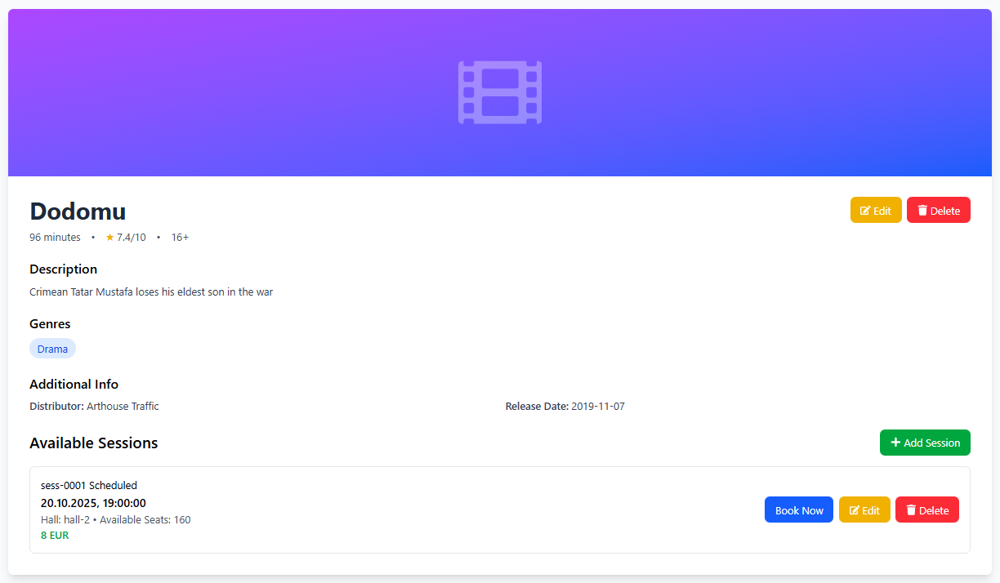 | 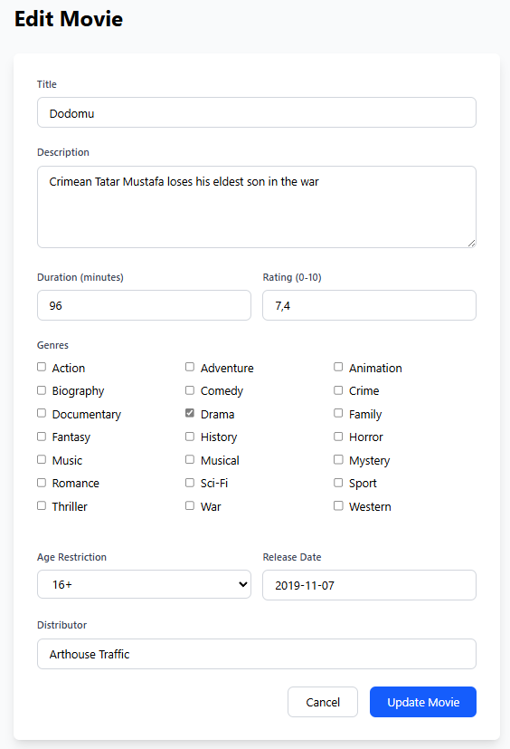 | 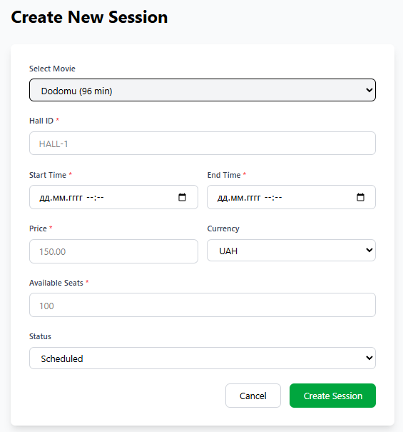 | 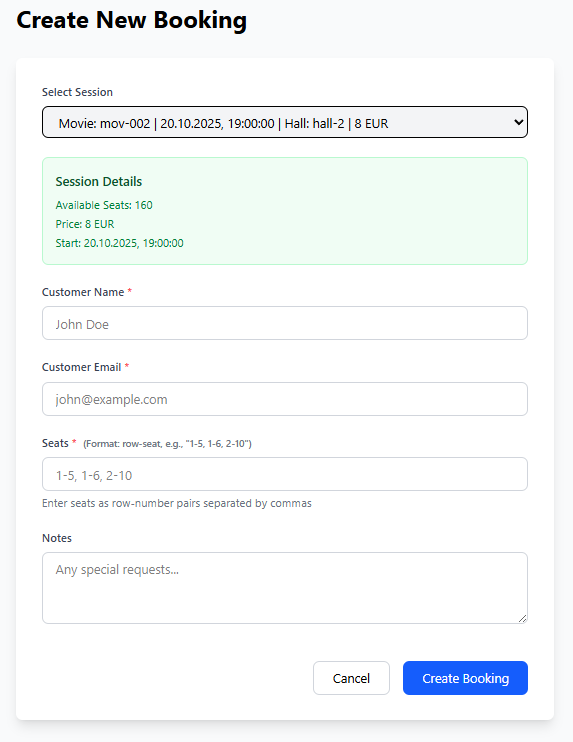 | 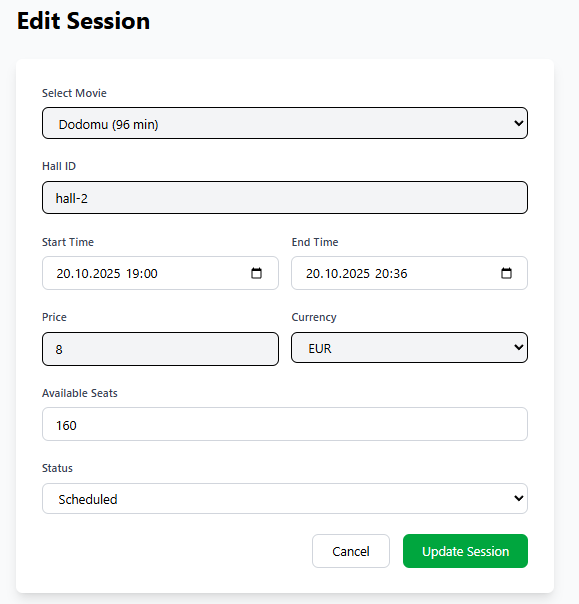 |

| Booking List                                  | Booking filtered by status                                      | Create Booking                                    | Booking Detail Page                               | Edit Booking                                  |
| :-------------------------------------------- | :-------------------------------------------------------------- | :------------------------------------------------ | :------------------------------------------------ | :-------------------------------------------- |
| 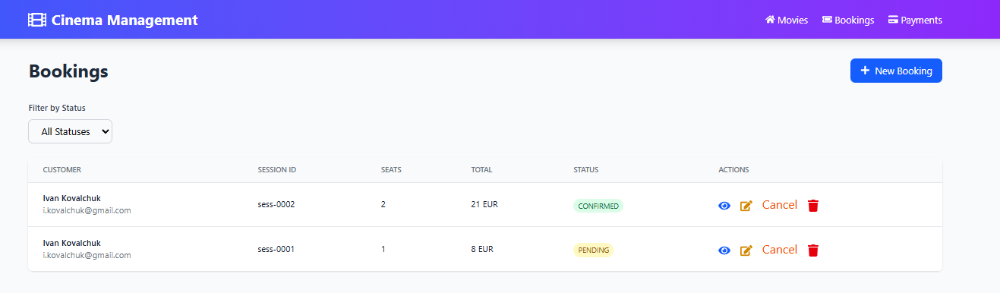 | 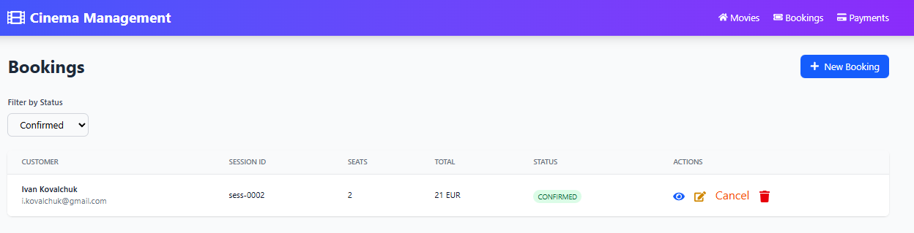 | 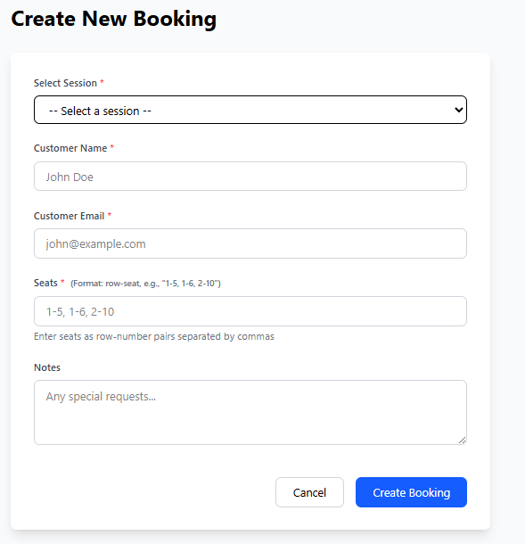 |  | 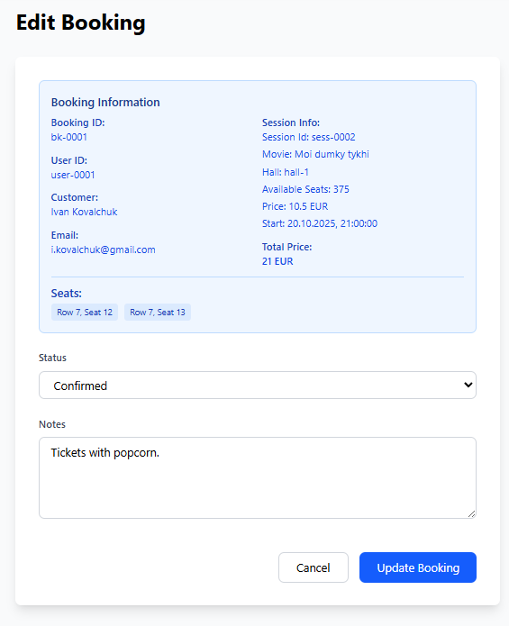 |

| Payment List                                  | Process Payment                                     |
| :-------------------------------------------- | :-------------------------------------------------- |
| 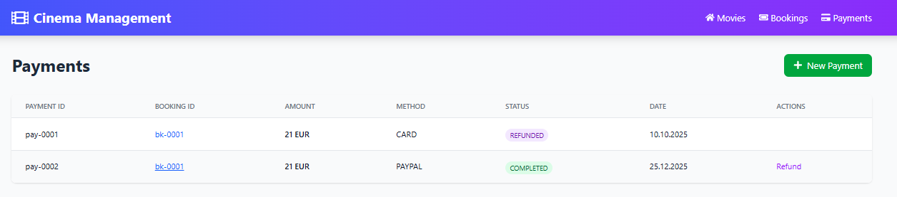 | 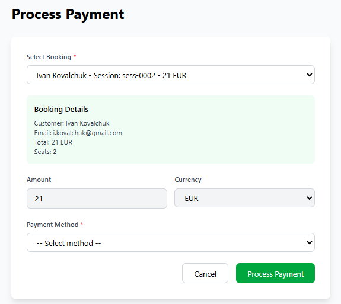 |

## 🏗️ Architecture Note

The frontend is designed to interact with a **distributed microservice backend**. It handles complex data relations, ensuring that payments are correctly linked to bookings, and bookings are tied to valid movie sessions.

## ⚙️ Setup & Installation

1. Clone the repository.
2. Install dependencies:
   ```bash
   npm install
   ```
3. Configure the API endpoint in your environment settings.
4. Launch the application:
   ```bash
   npm run dev
   ```
